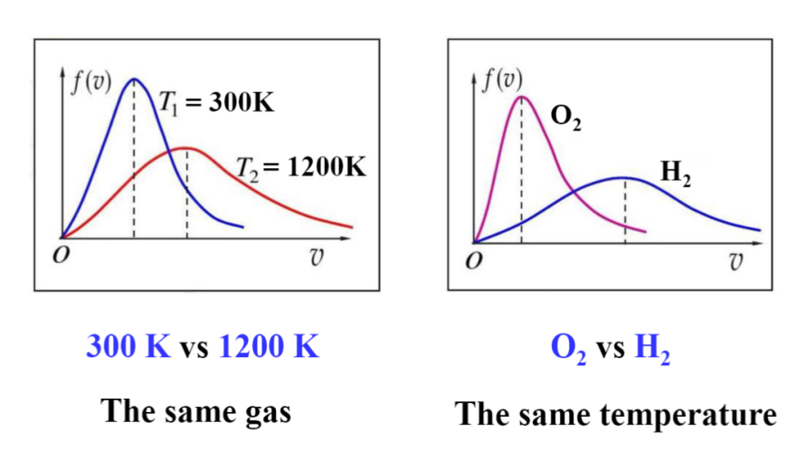

# **Theory of Gases** 气体动理论
## 1. [**The Ideal Gas Law**](#1)  理想气体定律 
## 2. [**Pressure and Temperature of Ideal Gas**](#2) 理想气体的压强和温度
## 3. [**Distribution of Molecular Speeds**](#3) 分子速度分布
## 4. [**Mean Free Path**](#4) 平均自由程
***
## 前置词汇  
* **Thermal Physics** - 热物理
* **Statistical Mechanics** - 统计力学
* **macroscopic observations** - 宏观观察
* **microscopic parameters** - 微观参数
* **fluctuate** - 波动
* **Thermodynamics** - 热力学
* **heat work and temprature** - 热，功和温度
* **pressure** - 压强
* **volume** - 体积
***
## 三个前置定律
* **Boyle's law** - 波义耳定律
```
    When T = C, PV = C
```
* **Charles's law** - 查理定律
```
    When P = C, V/T = C
```
* **Gay-Lussac's law** - 盖伊·卢萨克定律
```
    When V = C, P/T = C
```
***
## 1. **The Ideal Gas Law** 理想气体定律 <span id = "1"> </span>  
***
### 关键词汇：
* **densities** - 密度
* **number of moles** - 物质的量
* **neglected** 忽视
* **collision** 碰撞
* **elastic** 弹性的
***
### 内容：
* 在较低密度下， 所有理想气体遵循以下关系式：

    $PV = nRT$   （**ideal gas law**)  
    n : 物质的量(number of moles)  
    $R = 8.31 J(/mol K)$ - 通用气体常数(universal gas constant)


* 另一个形式 :   
    $PV = NkT$  
    $k = R/N_A$ - 玻尔兹曼常数(Boltzmann constant)  
    N : 分子总数(total number of molecules)

* 宏观(macroscopic)性质（P,V,T) 满足理想气体状态方程的气体称为 **理想气体**
* 理想气体的微观模型
  1. 密度小，分子大小小于平均距离
  2. 除碰撞外，分子间的相互作用可以忽略
  3. 所有的碰撞都是弹性碰撞
***
## 2.**Pressure and Temperature of Ideal Gas** 理想气体的压强和温度 <span id= "2"></span>
***
### 关键词汇：
* **kinetic theory of gases** - 气体动力学理论
* **equilibrium** - 平衡
* **distribution** - 分布
* **uniform** - 一致的
* **hypotheses** - 假设
* **measurement** - 量度
* **average translational kinetic energy** - 平均平动能
***
### 内容：
* 原子的大小约为$10^{-10}m$
* 分子的密度约为$3\times10^{19} cm^{-3}$
* 统计假设：  
    * 平衡状态， 气体分子的分布是均匀的  
      $n^{'}=dN/dV =N/V$  
    * 平衡状态，每个分子的速度指向任何方向的概率都是相同的。也就是说，分子速度在方向上的分布是均匀的，这导致所有速度分量的均方速度是相同的  
        $\overline{v^2_x}=\overline{v^2_y}=\overline{v^2_z}=\frac{1}{3}\overline{v^2}$

* $P=\frac{1}{3}\times{Nm\overline{v^2_{rms}}}=\frac{2}{3}n^{'}\overline{K}$
* $\overline{K}(分子平均平动动能)=(\frac{1}{2}mv^2)_{avg}=\frac{1}{2}mv^2_{rms}$
* 理想气体单个原子分子的平均平动动能公式 : $\overline{K}=\frac{3}{2}kT$
* 方均根速率(root-mean-square speed) : $v_{rms}=\sqrt{\overline{v^2}}=\sqrt{3KT/m}$
* 气体的压强、温度均是微观量的统计平均量(statistical average quantities)
* 气体的温度是气体分子平均平动动能的量度，宏观量T的微观意义：物体内部无规则热运动的剧烈程度
***
## 3.**Distribution of Molecular Speeds** 分子速度分布 <span id = "3"></span>
***
### 关键词汇
* **immense**-大的
* **fraction**-比例，分数
* **normalization**-归一化
* **The most probable speed**-最概然速率
### 内容
* 麦克斯韦分布(The Maxwell Distribution)  
  **$f(v)=4\pi(\frac{m}{2\pi kT})^{\frac{3}{2}}v^2e^{-\frac{mv^2}{2kT}}$**
* 物理意义  
  1. $f(v)=\frac{dN_v}{Ndv}$--速率v附近单位速率区间内分子数占总分字数的比例
  2. $f(v)dv=\frac{dN_v}{N}$--速率v占附近dv区间内分子数占总分子数的比例
  3. $\frac{\triangle N}{N}=\int_{v1}^{v2}f(v)dv$--v1 ~ v2 速率区间内分子数占总分子数的比例
* f(v)的两个性质 
  1. 归一化  
     $\int_{0}^{\infty}f(v)dv=1$  
     $\int_{0}^{N}\frac{dN}{N}=\int_{0}^{\infty}f(v)dv=1 $
  2. 当概率函数为$f(x)$,任意可测函数$\xi(x)$的平均值为    
     $\overline{\xi(x)}=\int_{-\infty}^{\infty}\xi(x)f(x)dx$
* 三种特殊速度
  1. 平均速度$\overline{v}$  
     $\overline{v}=\int_{0}^{\infty}vf(v)dv=\sqrt{\frac{8kT}{\pi m}}$
  2. 方均根速率$v_rms$  
     $v_rms=\sqrt{\frac{3kT}{m}}$
  3. 最概然速率$v_p$
     * 意义： 分布在速率$(v_p,v_p+dv)$速率间隔的分子数占总分子数的**概率最大**
     * $v_p=\sqrt{\frac{2kT}{m}}$
     * 温度和质量对最概然速率的影响
 * **麦克斯韦分布的条件**
   1. 热平衡
   2. 大量分子，大量碰撞
 * 公式的转换
   $\sqrt{\frac{kT}{m}}=\sqrt{\frac{RT}{M_mol}}$
***
## **mean free path** 平均自由程 <span id="4" ></span>
### 关键词汇
* **zigzag**-之字形的
* **uniform**-统一的
### 内容
* 定义： 平均自由程$l_M$:碰撞之间的平均距离
* $l_M=\frac{1}{4\pi\sqrt{2}r^2(N/V)}$
* 平均碰撞频率$\overline{Z}=\frac{\overline{v}}{l_M}=4\pi\sqrt{2}r^2\overline{v}n'$
* $n'=\frac{dN}{dV}=\frac{N}{V}$
   
