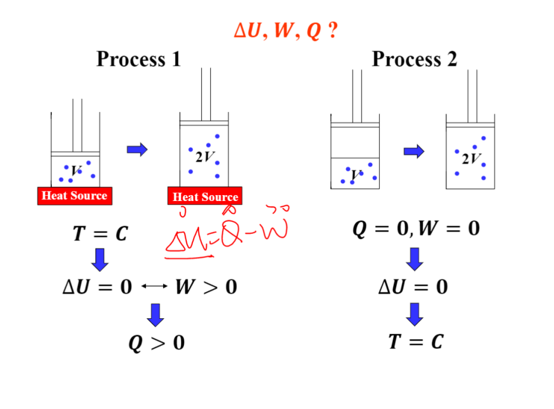
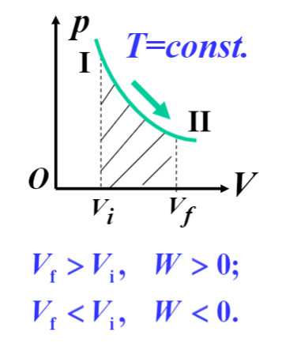
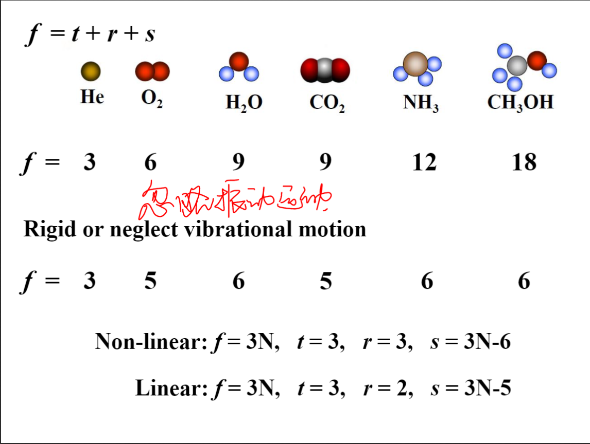
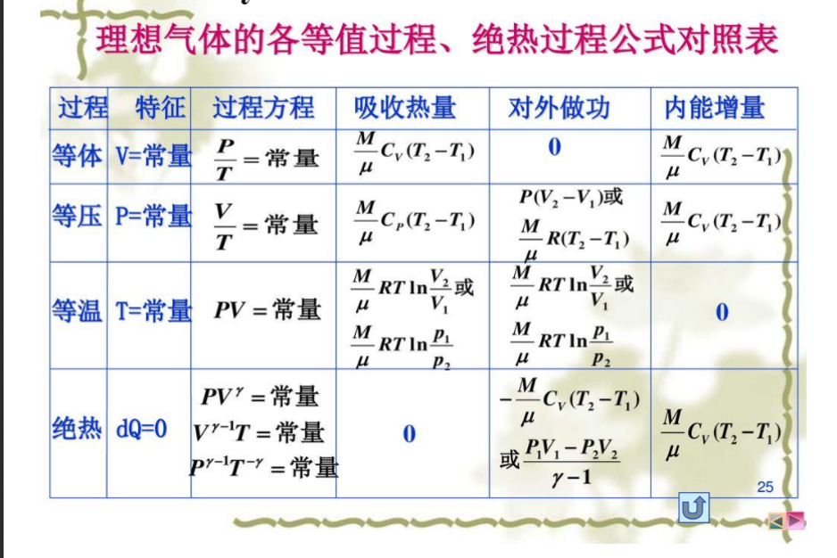
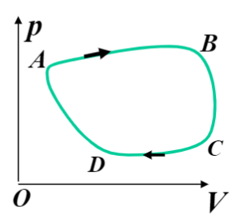
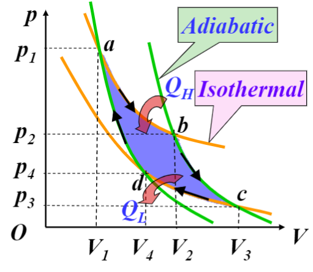
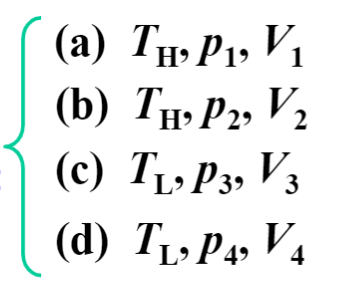

# **Thermodynamics** 热力学
## 1. [**Internal Energy and Specific Heat**](#1) 内能和比热容
## 2. [**The First Law of Thermodynamics**](#2) 热力学第一定律
## 3. [**Applying the First Law of Thermodynamics**](#3) 热力学第一定律的应用
## 4. [**Theorem of Equipartition of Energy**](#4) 能量均分定理
## 5. [**Adiabatic Expansion of an Ideal Gas**](#5) 理想气体的绝热膨胀
## 6. [**Heat Engines and the Efficiency**](#6) 热机及其效率
## 7. [**Entropy and the 2nd Law of Thermodynamics**](#7) 熵与热力学第二定律
***
## 1. **Internal Energy and Specific Heat** 内能和比热容<span id="1"></span>
### 关键词汇
* **internal energy**-内能
* **specific heat**-比热容
* **particles**-粒子
* **potential energy**-势能
* **extensive property**-广度性质
* **monatomic**-单原子的
* **rotational**-旋转的
* **vibrational**-振动的
***
### 内容
* 内能是系统中所有粒子的动能和势能的总和
* 内能不包括系统整体的动能和势能
* n摩尔单原子分子气体的内能  
  $U=N(\frac{1}{2}m\overline{v^2})=N\overline{K}=\frac{3}{2}NkT=\frac{3}{2}nRT$
* 若气体分子有多个原子，旋转和振动的能量也要计算，但只与温度有关  
  $U=U(T)$(理想气体)
* 热容(heat capacity) 一定质量的物体升高单位温度变化所需要的热量  
  $C=\frac{dQ}{dT}$
* 比热容 单位质量(物质的量)的物体的热容  
  $c=\frac{C}{m}=\frac{1}{m}\frac{dQ}{dT}$  
  $C_m=\frac{C}{n}=\frac{1}{n}\frac{dQ}{dT}$
* 物体从温度从T1升高到T2所需的热量  
  $Q=\int_{T1}^{T2}C(T)dT=m\int_{T1}^{T2}c(T)dT=n\int_{T1}^{T2}C_m(T)dT$ 
***
## 2. **The First Law of Thermodynamics** 热力学第一定律<span id="2"></span>
***
### 关键词汇
* **equilibrium**-平衡
* **macroscopic**-宏观的
***
### 内容
* p-V-T图可以用一个坐标描述系统的状态
  
* 该系统经过一系列变化，从状态1到状态2，每个状态都是一个新的平衡态
* 做功：  
  $dW=Fdl=pAdl=pdV$  
  $W=\int dW=\int_{V1}^{V_f}pdV$
* 功是过程曲线下的面积
  
* 功是过程量；气体膨胀，做正功；反之做负功
* 热力学第一定律：
  * 功和热量都是过程量，但是$Q-W$的值只与始末状态有关
  * $Q-W$表示某种**内在属性**，叫做**内能**$U$
  * 内能是状态量， $\triangle U=U_f-U_i=Q-W$---热力学第一定律
  * W,Q,U的符号
    * 系统做功-$W>0$
    * 系统吸热-$Q>0$
    * 系统能量增加-$\triangle U>0$
## 3. **Applying the First Law of Thermodynamics** 热力学第一定律的应用<span id="3"></span>
***
### 关键词汇
* **adiabatic**-绝热的
* **isolated**-孤立的
* **isochoric**-等体积的
* **isobaric**-等压的
* **isothermal**-等温的
* **hyperbola curve**-双曲线
***
### 内容
#### 1.**绝热过程**
* 系统与环境迅速发生或与无热量交换的过程
* $Q=0\rightarrow\triangle U=-W$
* 系统做正功，$\triangle U<0$
* 系统做负功，$\triangle U>0$
#### 2.**等体积过程**  
* 系统体积不变，做功为0
* $dW=pdV=0 || W=0$
* $Q=\triangle U=nC_v(T_2-T_1)$$C_v$(等体积下的摩尔比热容)
* 系统吸热,$\triangle U>0$
* 系统放热,$\triangle U<0$
* $\frac{p}{T}=constant || \frac{p1}{T1}=\frac{p2}{T2}$
#### 3.**等压过程**
* 系统压强不变
* $W=\int_{V1}^{V2}pdV=p(V_f-V_i)=nR\triangle T$
* **$Q=\triangle U+W=nC_p(T_2-T_1)$**
* $C_p$：等压状态下的摩尔比热容
* 气体吸收的热量一部分用于增加内能，另一部分用于对外作功
* $\frac{V}{T}=constant$
* **$C_v和C_p$** 之间的关系  
  结论：$C_p=C_v+R$(Mayer's formula,迈耶公式)
#### 4.**等温过程**
* 气体膨胀或收缩时保持温度不变
* $\triangle U=0\rightarrow Q=W$
* $pV=C$
* 等温线在p-V图上是双曲线
* **$W=nRTln\frac{V_f}{V_i}=nRTln\frac{p_i}{p_f}$**
***
## **Theorem of Equipartition of Energy** 能量均分定理<span id="4"></span>
***
### 关键词汇
* **degrees of freedom**-自由度
* **coordinates**-坐标
***
### 内容
* 自由度：确定物体的空间位置所需要的独立坐标数目
* 公式：**$f=t+r+s$**
* 能量均分定理；在温度为T 的平衡态下,气体分子每个自由度的平均能量都相等
* 一个气体分子的平均平动动能：$\overline{K}=\frac{f}{2}kT$
* **n摩尔**气体分子的总平动动能：$E_k=nN_A\overline{K}=\frac{f}{2}nRT$
* 对于内能来说：$f = t + r + 2s$
* 理想气体的内能是一个只与温度相关的函数：$U=\frac{f}{2}nRT$
* 等体积状态下的摩尔比热容：$C_v=\frac{1}{n}\frac{(dQ)_v}{dT}=\frac{1}{n}\frac{dU}{dT}$
* 任意过程都适用：$U=nC_VT || \triangle U = nC_v\triangle T$
* 
***
## **Adiabatic Expansionof an Ideal Gas** 理想气体的绝热膨胀<span id="5"></span>
***
### 关键词汇
***
### 内容
* 绝热过程：$Q=0 , dQ=0$
* 结论：
  * $pV^{\gamma}=C$
  * $V^{\gamma-1}T=C$
  * $p^{\gamma-1}T^{-\gamma}=C$  
  其中$\gamma=C_p/C_v$
* 气体在准静态绝热过程中做的功：**$W=\frac{p_1V_1-p_2V_2}{\gamma-1}$**
* 
***
## **Heat Engines and the Efficiency**-热机及其效率<span id="6"></span>
***
### 关键词汇
* **extracts**-提取
* **working substance**-工作介质
* **reversible**-可逆的
* **friction**-摩擦
* **turbulence**-动荡
***
### 内容
* 热机：从环境中吸收热量并做有用的功
* 热机的核心是工作介质，如汽车引擎中的汽油-空气混合物
* 介质吸收高温热源的热量，一部分做功，另一部分热量传递给低温热源
* 若系统从一个确定的状态开始，经过一系列闭合的热力学过程，最后回到了原来的状态，那么这个过程称为循环(cycle)
* 循环过程的重要性质：$\triangle U=0$
* 如果该循环可以被认为是一系列准静态过程，那么这个循环就被称为可逆的；否则就是不可逆的
* 可逆循环可以用pV图表示出来
***
* 热机的效率
* 结论：由于$Q_H=W+|Q_L|$，所以$\eta=\frac{|W|}{|Q_H|}=1-\frac{|Q_L|}{|Q_H|}$
***
* 卡诺热机：一种理想热机，所有的过程都是可逆的；没有由于摩擦和动荡造成的能量损失
* 卡诺循环包括两个等温过程和两个绝热过程
* 卡诺热机的效率：结论：$\eta_c=1-\frac{T_L}{T_H}$
* 理想气体卡诺循环的效率是最高的：$\eta<=\eta_r=1-\frac{T_L}{T_H}$
***
## **Entropy & the 2nd Law of Thermodynamics** 熵与热力学第二定律 <span id="7"> </span>
***
### 关键词汇
* **entropy**-熵
* **undergoes**-经受
* **capable**-能够
* **restore**-恢复
* **friction**-摩擦
* **unrestrained**-不受控制的
* **finite**-有限的
* **spontaneous**-自发的
* **variable**-变量
* **deduce**-推断
* **isentropic**-等熵的
* **latent heat**-相变潜热
***
### 内容
* **不可逆过程** 系统和环境不能同时恢复到最初的状态
* 不可逆过程示例  
  ```
  摩擦
  液体的自发流动
  有限次数的温差传热
  两种物质的自发融合
  ...
  ```
* 自然界的一切自发过程都是单向进行的不可逆过程
*** 
* **熵**
* 计$Q_H$为+，代表系统吸收的热量，$Q_L$为-，系统失去的热量
* 卡诺循环中，$\frac{Q_H}{T_H}+\frac{Q_L}{T_L}=0$
* 所有可逆循环可以被近似地看作一系列卡诺循环，$\sum\frac{Q}{T}=0$
* 可逆循环中，$\oint\frac{dQ}{T}=0$
* 系统经历任意可逆循环一周后，其热温比之和为0
* 熵S的定义$dS=\frac{dQ}{T}$
* 可逆循环中，$\oint dS=0$
* $\triangle S=S_b-S_a=\int_a^b dS=\int \frac{dQ}{T}$
* 熵是一个 **状态量**， 只与初末状态有关，与过程无关
***
* **ex**
* 熵是一个状态方程，$S=S(T,V),S=S(T,P)$
* 熵只能通过实验推导
* 熵的国际单位制是$J/K$，焦耳每开尔文
* $\triangle S=nC_vln\frac{T_2}{T_1}+nRln\frac{V_2}{V_1}$
* 熵与T或V正相关
* 等温过程中，$T_1=T_2$，$\triangle S = nRln\frac{V_2}{V_1}=nRln\frac{p_1}{p_2}$
* 等体积过程中，$V1=V2$，$\triangle S=nC_vln\frac{T_2}{T_1}$
* 等压过程中，$p_1=p_2$，$\triangle S=nC_pln\frac{T_2}{T_1}$
* 在可逆绝热过程中，$dQ=0,所以\triangle S=0$，称为等熵过程
***
* **热力学第二定律**
* 只涉及平衡态的可逆过程，系统和环境的熵变之和为0
* $\rightarrow dS_{system}+dS_{enviroment}=0$
* **相变潜热**，热力学系统的等温过程中释放或吸收的能量，$Q=mL$,L就是**比潜热**
